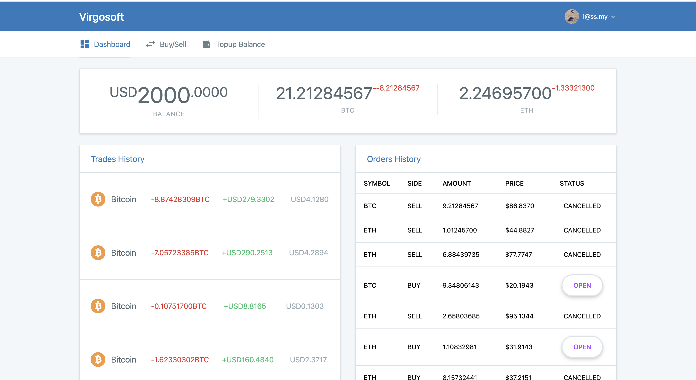

## About

A clone of trading platform with live reload using Pusher. Zero vibe coding.



## Prerequisites

- Docker
- Pusher credentials

## Tech Stacks

- Laravel Framework 12
- MySQL 8.4
- Vue 3
- Inertia 2

## Installation using Docker

1. Copy Environment Variables, & set Pusher credentials
```
cp .env.example .env
```
2. Install Dependencies
```
docker run --rm \
 -u "$(id -u):$(id -g)" \
 -v "$(pwd):/var/www/html" \
 -w /var/www/html \
 laravelsail/php84-composer:latest \
 composer install
```
3. Generate App Key
```
docker run --rm \
 -u "$(id -u):$(id -g)" \
 -v "$(pwd):/var/www/html" \
 -w /var/www/html \
 laravelsail/php84-composer:latest \
 php artisan key:generate
```
4. Run Laravel Sail
```
./vendor/bin/sail up
```
5. Access into Docker container
```
docker exec -it virgosoft-laravel.test-1 sh
```
6. Run DB Migration
```
php artisan migrate
```
7. Build UI Assets
```
npm run build
```
The app should be accessible on `http://localhost`

## Test

```
php artisan test
```
```
   PASS  Tests\Unit\ExampleTest
  ✓ that true is true                                                                                                                                               0.03s  

   PASS  Tests\Listeners\FindOrderMatchTest
  ✓ handle filled order                                                                                                                                             0.92s  
  ✓ handle buy order                                                                                                                                                0.09s  
  ✓ handle sell order                                                                                                                                               0.07s  

   PASS  Tests\Feature\ExampleTest
  ✓ the application returns a successful response                                                                                                                   0.27s  

   PASS  Tests\Feature\Http\Controllers\OrderControllerTest
  ✓ get all                                                                                                                                                         1.37s  
  ✓ create buy                                                                                                                                                      0.19s  
  ✓ create sell                                                                                                                                                     0.09s  
  ✓ cancel buy                                                                                                                                                      0.10s  
  ✓ cancel sell                                                                                                                                                     0.09s  

   PASS  Tests\Feature\Http\Controllers\ProfileControllerTest
  ✓ register                                                                                                                                                        0.12s  
  ✓ login                                                                                                                                                           0.08s  
  ✓ logout                                                                                                                                                          0.08s  
  ✓ index                                                                                                                                                           0.12s  

   PASS  Tests\Feature\Repositories\AssetRepositoryTest
  ✓ get new                                                                                                                                                         0.08s  
  ✓ get existing                                                                                                                                                    0.07s  
  ✓ bought new                                                                                                                                                      0.07s  
  ✓ bought existing                                                                                                                                                 0.07s  
  ✓ lock                                                                                                                                                            0.07s  
  ✓ unlock                                                                                                                                                          0.07s  
  ✓ sold                                                                                                                                                            0.07s  

   PASS  Tests\Feature\Repositories\OrderRepositoryTest
  ✓ create                                                                                                                                                          0.07s  
  ✓ event listener                                                                                                                                                  0.08s  
  ✓ find                                                                                                                                                            0.07s  
  ✓ update                                                                                                                                                          0.08s  
  ✓ find sell order                                                                                                                                                 0.09s  
  ✓ find buy order                                                                                                                                                  0.10s  

   PASS  Tests\Feature\Repositories\TradeRepositoryTest
  ✓ create                                                                                                                                                          0.08s  

   PASS  Tests\Feature\Repositories\UserRepositoryTest
  ✓ create                                                                                                                                                          0.07s  
  ✓ find                                                                                                                                                            0.07s  
  ✓ deduct balance                                                                                                                                                  0.07s  
  ✓ topup balance                                                                                                                                                   0.07s  

   PASS  Tests\Feature\Services\OrderServiceTest
  ✓ create buy order                                                                                                                                                0.09s  
  ✓ cancel buy order                                                                                                                                                0.09s  
  ✓ fill buy order                                                                                                                                                  0.08s  
  ✓ fill buy order partial                                                                                                                                          0.08s  
  ✓ create sell order                                                                                                                                               0.08s  
  ✓ cancel sell order                                                                                                                                               0.08s  
  ✓ fill sell order                                                                                                                                                 0.07s  
  ✓ fill sell order partial                                                                                                                                         0.08s  

   PASS  Tests\Feature\Services\TradeServiceTest
  ✓ create                                                                                                                                                          0.10s  
  ✓ find sell order no match                                                                                                                                        0.08s  
  ✓ find sell order match                                                                                                                                           0.10s  
  ✓ find sell order match partial                                                                                                                                   0.11s  
  ✓ find buy order no match                                                                                                                                         0.07s  
  ✓ find buy order match                                                                                                                                            0.11s  
  ✓ find buy order match partial                                                                                                                                    0.11s  

  Tests:    47 passed (501 assertions)
  Duration: 6.63s

```

## License

The Laravel framework is open-sourced software licensed under the [MIT license](https://opensource.org/licenses/MIT).
